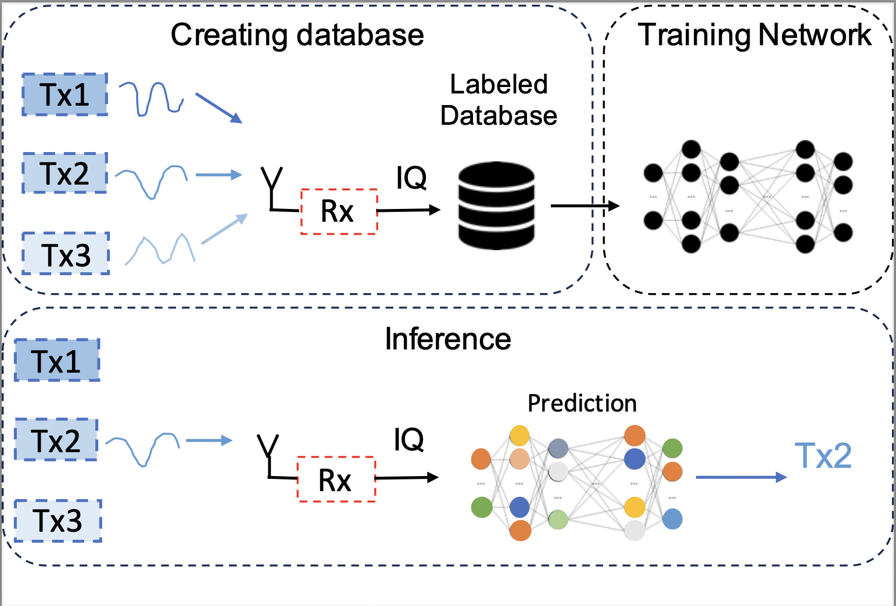
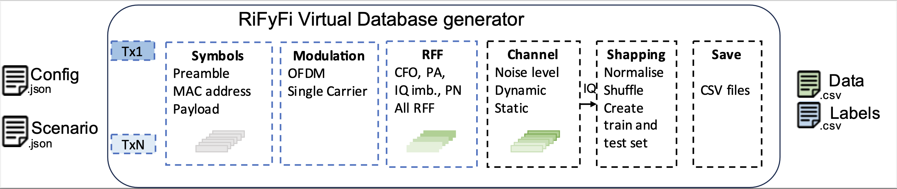
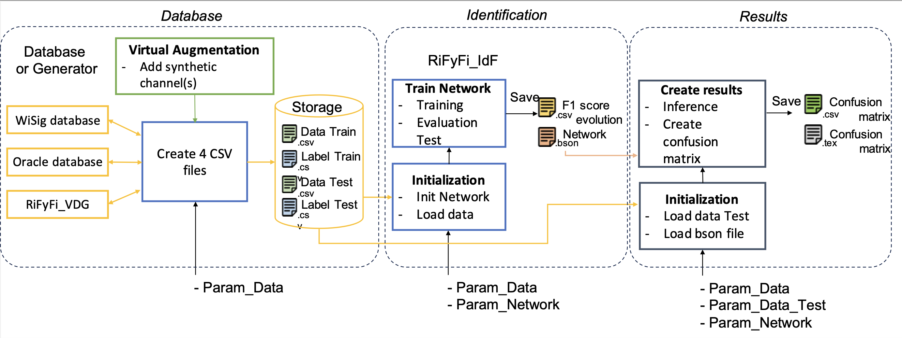

# RiFyFi.jl 

[](https://github.com/achilletIrisa/RiFyFi.jl/actions/workflows/CI.yml?query=branch%3Amain)


RiFyFi is a framework for Radio Frequency Fingerprint (RFF) Identification. RFF is a unique signature created in the emitter transmission chain by the hardware impairments. These impairments may be used as a secure identifier as they cannot be easily replicated for spoofing purposes. In recent years, the RFF identification relies mainly on Deep Learning (DL), and large databases are consequently needed to improve identification in different environmental conditions. RiFyFi is introduced to propose an identification framework which can used different type of database experimental or simulated. 

The objective is to use a labelled database to train a DL network and then evaluate the network classification accuracy on a different recording scenario, as presented below

<div align="center">
  
</div>


In this framework we have also implemented severals parameterizable models of component impairments (the RFF), to create some virtual databases based on different transmission parameters and impairments scenarios.
The database generator offers a large flexibility thanks to the severals parameters the type of frame, the modulation type, the impairments and the presence of propagation channel or noise. 

<div align="center">
  
</div>

RiFyFi is composed of different subpackage 
- RiFyFi_VDG : The Virtual Database Generator, Package to create a virtual dataset
- Oracle_Database : Package to create a dataset with the database Oracle
- WiSig_Database : Package to create a dataset with the database WiSig
- Experiment_Database : Package to create a dataset with our own experimental records
- RiFyFi_IdF : Package for training and testing network
- Augmentation : Package used for data augmentation
- Results : Package to create some confusion matrix or F1 score evolution in function of time.

<div align="center">
  
</div>


## Protocol to use RiFyFi with Julia 

- Insatall Julia (here develop with 1.8.5)
- Create a folders
- Download or clone the project with: git clone https://github.com/JuliaTelecom/Rifyfi.jl
- Going in Rifyfi.jl folders
- Open a Julia terminal
- From the Julia REPL, type `]` to enter the Pkg REPL mode and run:

```pkg
pkg> activate .
pkg>  instantiate
```
Then you can run the script script_RiFyFi.jl, in the Julia Terminal :
```
julia> include("src/script_RiFyFi.jl")
```

If you want to create your own scenario use the script example to configure the database generator.

You can use RiFyFi in two manners: 
-   Creating random parameter values for impairments 
-   Define the value of the impairments parameters with scenario file, for example a scenario file is propose with 6 transmitters and 5% of similarity between Impairments. 


Please if you have any question don't hesitate to contacte me : alice.chillet@irisa.fr


