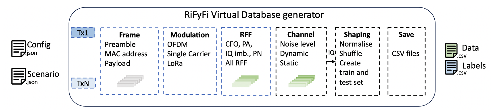

# RiFyFi.jl 

[](https://github.com/achilletIrisa/RiFyFi.jl/actions/workflows/CI.yml?query=branch%3Amain)

## Introduction

RiFyFi is a framework for Radio Frequency Fingerprint (RFF) identification. RFF is a unique signature created by hardware impairments in the transmitter's transmission chain. These impairments can be used as a secure identifier as they cannot be easily replicated for spoofing purposes. In recent years, RFF identification has mainly relied on Deep Learning (DL), so large databases are needed to improve identification in different environmental conditions. RiFyFi is introduced to propose an identification framework that can use different types of experimental or simulated databases. 

The objective is to use a labelled database to train a DL network and then evaluate the network's classification accuracy on a different recording scenario, as presented below.


<div align="center">
  
</div>

## Virtual database -- Impairment model 

In this framework, we have also implemented several parameterisable models of component impairments (the RFF) to generate some virtual databases based on different transmission parameters and impairment scenarios.
The database generator offers great flexibility thanks to the different parameters of the frame type, the modulation type, the impairments and the presence of a propagation channel or noise. 


<div align="center">
  
</div>

## RiFyFi Package organisation 

RiFyFi consists of several subpackages 
- RiFyFi_VDG : The Virtual Database Generator, package to create a virtual dataset
- Oracle_Database : Package to create a dataset with the Oracle database
- WiSig_Database : Package to create a dataset with the WiSig database
- Experiment_Database : Package to create a dataset with your own experiment datasets
- RiFyFi_IdF : package for training and testing the network
- Augmentation : package for data augmentation
- Results : package to generate a confusion matrix or F1 score evolution over time.


<div align="center">
  
</div>

Other folders: 
- run: backup file for trained neural networks.
- Results: backup file for confusion matrices 
- CSV_Files: backup file for generated dataset (csv format) 
- Configuration: backup file for scenario and configuration file used to create a virtual database
- **src**: script and subpackage 

## Protocol to use RiFyFi with Julia 

- Insatall Julia (developing with 1.8.5 here)
- Create a folder
- Download or clone the project using: git clone https://github.com/JuliaTelecom/Rifyfi.jl
- Go into the Rifyfi.jl folder
- Open a Julia terminal
- From the Julia REPL, type `]` to go into Pkg REPL mode and run:

```pkg
pkg> activate .
pkg> instantiate
```
Then you can run the script script_RiFyFi.jl in the Julia terminal:
```
julia> include("src/script_RiFyFi.jl")
```

If you want to create your own scenario, use the example script to configure the database generator.

You can use RiFyFi in two ways: 
- Generate random parameter values for impairments 
- Define the value of the impairment parameters with a scenario file, for example a scenario file with 6 stations and 5% similarity between impairments is proposed. 


If you have any questions please don't hesitate to contact me : alice.chillet@irisa.fr

