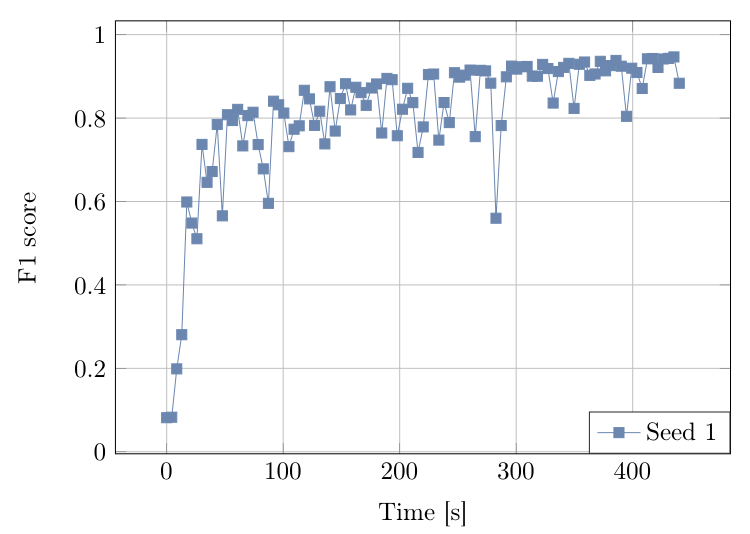
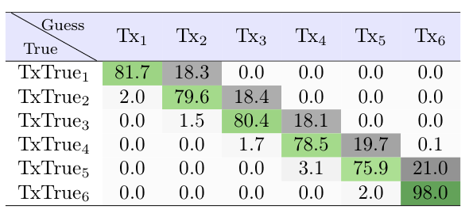
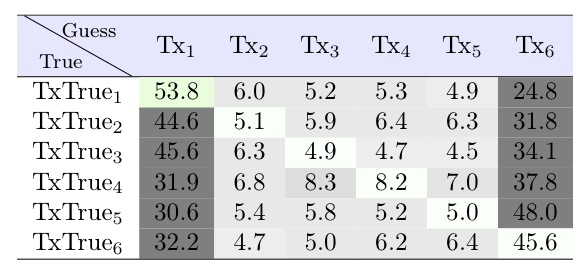

# Tutorial 

[](https://github.com/achilletIrisa/RiFyFi.jl/actions/workflows/CI.yml?query=branch%3Amain)


This README details the different script results and how you can modify them. 

Don't hesitate to use this README as a tutorial if you want to understand the different RiFyFi mode quickly. 

## RiFyFi with Virtual Database Generator

Use the script script_RiFyFi.jl if you have aldready install julia and RiFyFi package and instantiate it you can run the script


```
julia> include("src/script_RiFyFi.jl")
```

Here the generated dataset is composed of 6 transmitters that transmit 10000 signals, each signal is composed of 256 IQ samples. The RFF parameters of each transmitters is defined by the scenario file in Configurations --> No_channel_6_256 --> E3_all_impairments_5_pourcent (configuration = "scernario")
All the impairments are activated (RFF = "all_impairments")

The variable S described the type of frame (symbols) S1 for preamble, S2 for Mac address, S3 for payload 

- Preamble: all the transmitters send the same sequence
- Mac adress: each transmitter send its own sequence
- Payload: all the sequences are different and are not reapeted 

Variable E described the Fingerprint let E at E3 to active the RFF else E1 to desactivated the RFF

Then C described the Channel in particular the noise different possibilities are propose 

- C1: no noise 
- C2: 30dB gaussian noise
- C2_20dB: 20dB gaussian noise 
- C2_15dB: 15dB gaussian noise 
- C2_10dB: 10dB gaussian noise 
- C2_0dB: 0dB gaussian noise 

Finally no propagation channel model are added to the signals.

The choosed network is called AlexNet and the training parameters are define such as the learning rate and the dropout.

By running the file without modification you will obtained the result below.


In run/Synth/No_channel_6_256_AlexNet/E3_S1_C2_20dB_all_impairments_10000_5_pourcent/GPU 
you can found this type of figure with the F1-score evolution in function of time.
<div align="center">
  
</div>


In Results/No_channel_6_256_AlexNet
You can found the Confusion Matrix obtained in test
<div align="center">
  
</div>

Then in Results/augment_6_256_AlexNet
You can found the Confusion Matrix obtained in test with the adding of propagation channel model
<div align="center">
  
</div>

The Confusion matrix show that the network is not able to classify/identify correctly the transmitters means that the channel resilience is bad.


Now you can change the content of script_RiFyFi.jl to train a network with an other database (RFF scenario, more transmitters, transmission scenario)


To illustrate the possibilities you can choose to add data augmentation in the training dataset and then evaluated the resilience of the network.

In the script change the following lines:
```
########### Augmentation struct ###########
augmentationType = "augment"
Channel = "etu"
Channel_Test = "etu"
nb_Augment = 100
#seed_channel = 12
#seed_channel_test = 12
#burstSize =64
```

You can train different networks with different nb_Augment values and observed the impact of the propagation channel diversity on the network resilience.


## RiFyFi with WiSig Database
